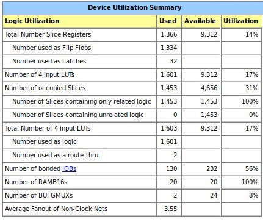

Schwap CPU Benchmarks
=====================

These are numbered the same as in the milestone specs. Last updated 2016-02-18T02:13:42-05:00

1.  76 Bytes to store Euclid's Algorithm and relPrime
2.	45,144 instructions run
3.	112,860 cycles to run relPrime with 0x13B0
4.	2.5 cycle/instruction average
5.	2GHz, or 500ps per cycle
6.	61 µs total run time
7.	3865 gates
8.

